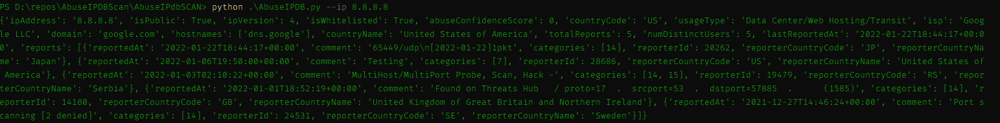
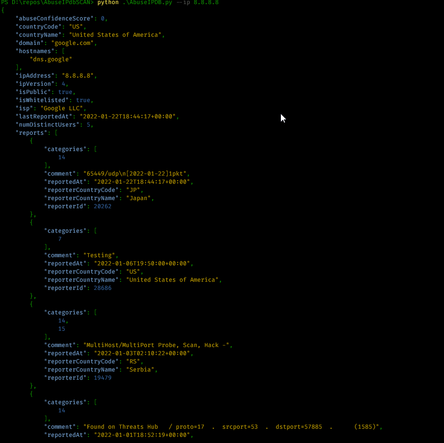
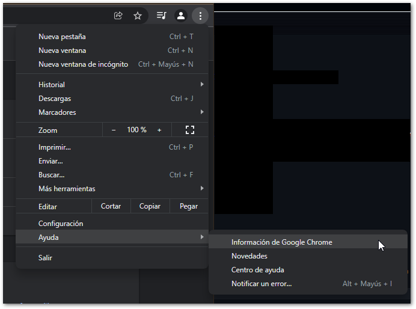

# AbuseIPDB Scanner with a better JSON looking
So a friend of mine @Rafael and I were looking to make this thing even better because I use it every day work.

Originally written by Mikebanks
<https://github.com/mikebanks/AbuseIPdbSCAN/>

This is a python script that will parse IP addresses from files or manually interact with AbuseIPDB API. It will return the information about the IP into standard out in various outputs.

The main change is that it showed like this before


And now it's looking like this:



I think it's a more comfortable way to see the data.

**UPDATE**

Now if you want the script to make a Screenshot the case in AbuseIPDB.com and you have GoogleChrome Installed, watch the version and download the same on here: <https://chromedriver.chromium.org/downloads/> so you can take all the advantages that this fork offers to you!
It's simple. Go to Options -> Help -> About Google Chrome



Now download the ChromeDriver and declare the directory you moved it in the code in line 244 of AbuseIPDB.py .

``` PYTHON
driver = webdriver.Chrome("D:\Chromedriver\chromedriver.exe")
```

PS: It would possibly be necessary to install a good adblocker on your google chrome web browser to make sure the screenshots are seen well.

## Installation

``` BASH
git clone https://github.com/JohnMorgan1234/AbuseIPdbSCAN.git
```

## Requirements

``` BASH
pip3 install -r requirements.txt
```


## AbuseIPDB API Key

In order to use the script you will need an API key. The AbuseIPDB API key information can be found here: V2: <https://docs.abuseipdb.com/>

## Usage

Basic Commands:

Short Form    | Long Form     | Description
------------- | ------------- |-------------
-f            | --file        | parses IP Addresses from a single given file
-b            | --block       | lookup an IP block
-d            | --days        | take in the number of days in history to go back for IP reports. Default: 30 Days
-i            | --ip          | lookup a single IP address
-v            | --version     | displays version information
-cc           | --countrycode | select a country code to check IP range

Output commands:
Short Form    | Long Form     | Description
------------- | ------------- |-------------
-c            | --csv         | outputs items in comma seperated values
-j            | --json        | outputs items in json format (reccomended)
-l            | --jsonl       | outputs items in jsonl format (reccomended)
-t            | --tsv         | outputs items in tab seperated values (Default)
-x            | --translate   | by default categories are numbers, with this flag it will convert them to text


### Examples

* To search for reports on an IP address:

``python3 AbuseIPDB.py -i 1.1.1.1``

* To search for reports on an IP Block:

``python3 AbuseIPDB.py -b 1.1.1.0/24``

* To search a whole country IP range and translate the categories to names:

``python3 AbuseIPDB.py -cc nz -x``


Thanks to the main author Mikebanks <https://github.com/mikebanks/> and my friends Pol & Rafael for giving me the advice with that awesome python libs!😁
